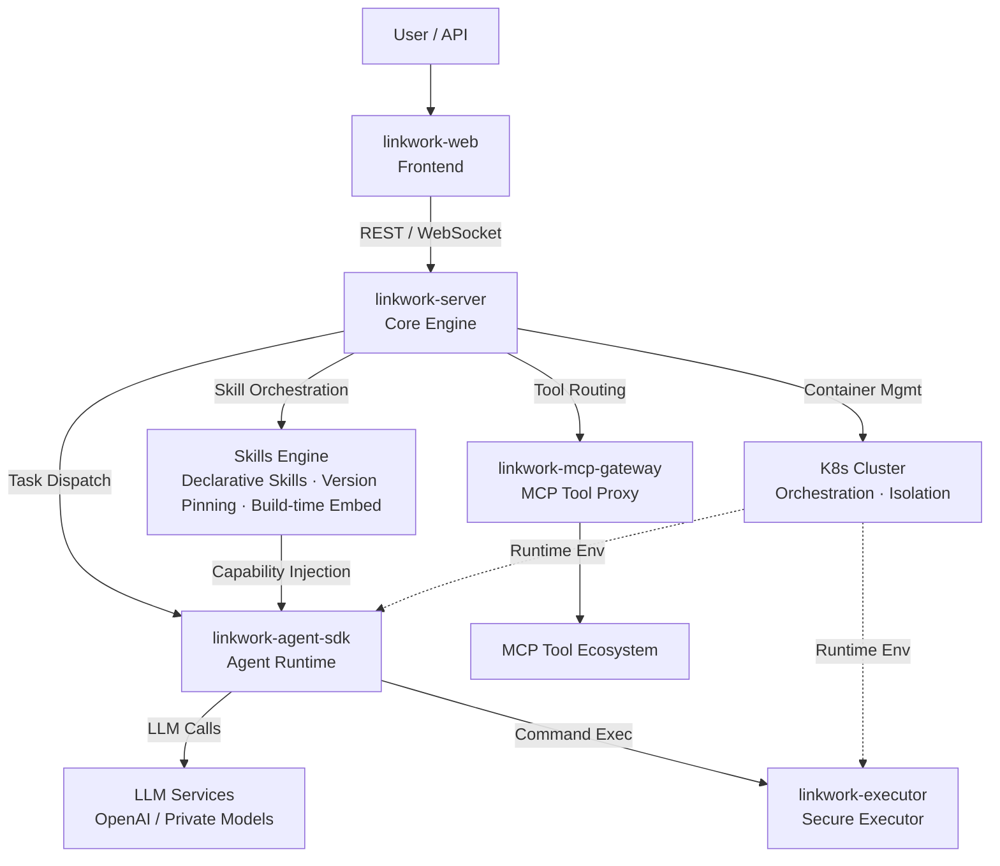

<div align="center">


# LinkWork (灵工)

### 🤖 Make AI Work Like Your Team

**Open-source enterprise AI workforce platform — Roles · Skills · Tools · Security · Scheduling, all in one place**

English | [中文](./README_zh-CN.md)

[](./LICENSE)
[](https://github.com/momotech/LinkWork/stargazers)
[](https://github.com/momotech/LinkWork/issues)
[](./CONTRIBUTING.md)

</div>

---

## Introduction

LinkWork is an open-source enterprise **AI Agent platform**. It does not just make AI "answer", it makes AI "deliver". You can manage containerized AI employees at scale and govern roles, Skills, MCP tools, and security policies with declarative configuration.

From task orchestration to result delivery, LinkWork turns AI workflows into a standardized production line: orchestratable, observable, auditable, and reusable.

It is not a personal assistant. It is an **AI team operating system** built for organizational collaboration.

## Features

### ⚡ Fast to Launch: From "Using AI" to "Using AI Well"

- **Role template management** — Define responsibilities, persona, available Skills, and tool permissions in one place, then instantiate and run
- **Container-level isolation** — AI employees run in independent containers with isolated filesystem, network, and processes
- **Elastic scheduling and quota governance** — Configure per-role resource quotas, scale out during peak load, and release resources when idle

### 🔐 Governable: Clear and Controllable Capability Boundaries

- **Skills version pinning** — Declarative capability modules with independent versioning, injected into role images at build time
- **MCP tool bus** — MCP-compatible unified proxy, auth, health checks, and metering
- **Three-layer capability boundaries** — Role -> Skills -> Tools, with flexible composition, controllable permissions, and traceable accountability

### ✅ Real Delivery: Results Directly Enter Production Workflows

- **Real-time task orchestration** — Streaming task execution tracking with full observability
- **Scheduled shifts** — Unattended execution based on scheduled tasks
- **Dual delivery channels** — Git / OSS delivery modes so task outputs can flow directly into engineering pipelines
- **End-to-end audit trail** — Unified traces for LLM calls, command execution, and tool requests to satisfy audit and compliance requirements

### 🌱 Evolvable: Platform Capability Keeps Expanding

- **AI supply chain governance** — End-to-end management across image build, security scanning, version snapshots, discovery, and audit
- **Vector memory and multi-model support** — Long-term knowledge retention, semantic retrieval, and model switching

## Highlights

### 🧱 One Role, One Image: Keep Uncertainty in the Build Phase

Skills, MCP configuration, and security policies are baked into role images at build time and stay read-only at runtime. Any config change requires rebuilding the image, eliminating environment drift and ensuring predictable, reproducible production environments.

- **Build-time solidification** — Skills injection, MCP descriptor generation, security policy packaging, and version snapshots in one pass
- **Context preloading** — Task startup automatically syncs Skills, prepares Git repositories, and assembles three-layer prompts
- **Fail-fast** — Any critical step failure immediately aborts the build, preventing incomplete capabilities from going live

> One role, one image: environment as code, versions pinned, builds reproducible, failures exposed early.

### 📦 Deliverable-Oriented: Not "Chat and Done"

LinkWork emphasizes "output as deliverable." Task results can flow directly into code review, object storage, and audit systems, forming an engineering loop that is deliverable, archivable, and reviewable.

### 🛡️ Security by Default: Not Relying on "Human Discipline"

The platform uses non-bypassable, multi-layer security by design: deep command analysis, privilege separation between execution and security processes, network disabled by default, and human approval for high-risk operations. AI employees are unaware of the security proxy, reducing bypass space at the architectural level.

> Enterprises do not need AI that "probably works" — they need deliverable, auditable, and constrained engineering productivity.

## Architecture



**How it works**: User creates a task → Core engine allocates a container in the K8s cluster → Agent runtime starts in an isolated environment → Calls LLM for reasoning, securely executes commands through the executor → MCP gateway proxies external tool calls → Execution status streams back in real time.

## How It Differs from Personal AI Agents

Projects like OpenClaw are excellent personal AI assistants — running on your laptop, one Agent handling your daily tasks. LinkWork addresses a different level of the problem:

| | Personal AI Assistants (e.g. OpenClaw) | LinkWork |
|---|--------------------------------------|----------|
| **Positioning** | Personal productivity tool | Enterprise workforce platform |
| **Scale** | Single user, single Agent | Multi-team, multiple AI workers in parallel |
| **Runtime Env** | Local single machine | K8s cluster, container isolation |
| **Capability Mgmt** | Community plugins, self-install | Role → Skill → Tool, three-tier governance |
| **Security** | Relies on user discretion | Approval workflow + policy engine + audit |
| **Deployment** | `npm install -g` | Docker Compose (dev) / K8s (prod) |
| **Skills Reuse** | Personal accumulation, hard to share | Skills proven on personal tools migrate directly in, shared across teams, reliably executed |

> Personal assistants solve "my productivity". LinkWork solves "organizational effectiveness". Skills you've refined on personal tools can go straight into LinkWork, becoming standardized capabilities your entire team can use.

## Components

| Component | Description | Status |
|-----------|-------------|--------|
| **[linkwork-server](https://github.com/momotech/linkwork-server)** | Core backend — task scheduling, role management, approvals, Skills & tool registry | Open sourced |
| **[linkwork-executor](https://github.com/momotech/linkwork-executor)** | Secure executor — in-container command execution, policy engine | Open sourced |
| **[linkwork-agent-sdk](https://github.com/momotech/linkwork-agent-sdk)** | Agent runtime — LLM engine, Skills orchestration, MCP integration | Open sourced |
| **[linkwork-mcp-gateway](https://github.com/momotech/linkwork-mcp-gateway)** | MCP tool gateway — tool discovery, auth, usage metering | Open sourced |
| **[linkwork-backend](https://github.com/momotech/linkwork-backend)** | Backend application — Spring Boot service integrating linkwork-server starters, image build, and task orchestration | Open sourced |
| **[linkwork-web](https://github.com/momotech/linkwork-web)** | Frontend reference — task dashboard, role config, Skills marketplace | Open sourced |

## Open-source Roadmap

All components have been fully open-sourced as of March 2026:

| Phase | Components | Description | Date |
|-------|-----------|-------------|------|
| Phase 1 | linkwork-server | Backend core with full scheduling engine and demo launcher | March 2026 |
| Phase 2 | linkwork-executor + linkwork-agent-sdk | Execution layer — secure executor + Agent runtime | March 2026 |
| Phase 3 | linkwork-mcp-gateway + linkwork-web | Access layer — MCP tool gateway + frontend reference implementation | March 2026 |

## Deploy

### Docker Compose (Development / Single Node)

Get the full platform running locally in minutes:

```bash
cd deploy/docker
cp .env.example .env          # edit .env to set DB passwords, JWT secret, etc.
docker compose up -d           # starts MySQL, Redis, backend, web, and more
```

Open `http://localhost:3003` to access the LinkWork UI. For details see [`deploy/docker/README.md`](./deploy/docker/README.md).

### Kubernetes (Production)

Production deployments use Kustomize overlays under `deploy/k8s/`:

```bash
# Dev cluster (Kind)
kubectl apply -k deploy/k8s/overlays/dev

# Production cluster
kubectl apply -k deploy/k8s/overlays/prod
```

Requires K8s v1.33+, Volcano, Harbor, and NFS. See [`deploy/k8s/README.md`](./deploy/k8s/README.md) and the full [Deployment Guide](./docs/guides/deployment.md).

## Documentation

| Document | Description |
|----------|-------------|
| [Quick Start](./docs/quick-start.md) | Prerequisites, cloning submodules, launching platform services |
| [Deployment Guide](./docs/guides/deployment.md) | Docker Compose dev setup, K8s production deployment |
| [Extension Guide](./docs/guides/extension.md) | Custom roles, Skills, MCP tools, file management, Git projects |
| [Workstation Model](./docs/concepts/workstation.md) | Role → Instance → Task model |
| [Skills System](./docs/concepts/skills.md) | Declarative skills, version pinning, build-time injection |
| [MCP Tools](./docs/concepts/mcp-tools.md) | Standardized external tool access |
| [Harness Engineering](./docs/concepts/harness-engineering.md) | One role, one image |
| [Architecture Overview](./docs/architecture/overview.md) | System context, components, tech stack |
| [Example: Literature Tracker](./docs/examples/literature-tracker.md) | Complete role configuration walkthrough |

> Full documentation index: [docs/README.md](./docs/README.md)

## Star History

<div align="center">
<a href="https://star-history.com/#momotech/LinkWork&Date">
  <picture>
    <source media="(prefers-color-scheme: dark)" srcset="https://api.star-history.com/svg?repos=momotech/LinkWork&type=Date&theme=dark" />
    <source media="(prefers-color-scheme: light)" srcset="https://api.star-history.com/svg?repos=momotech/LinkWork&type=Date" />
    
  </picture>
</a>
</div>

## License

[Apache License 2.0](./LICENSE)

## Stay Connected

All components have been open-sourced. If you're interested in enterprise AI workforce management:

- **Star** this repo to track progress
- **Watch** for release notifications
- Feel free to share ideas and suggestions in Issues

---

<div align="center">

**LinkWork** — Not just an AI assistant. An AI team.

</div>
