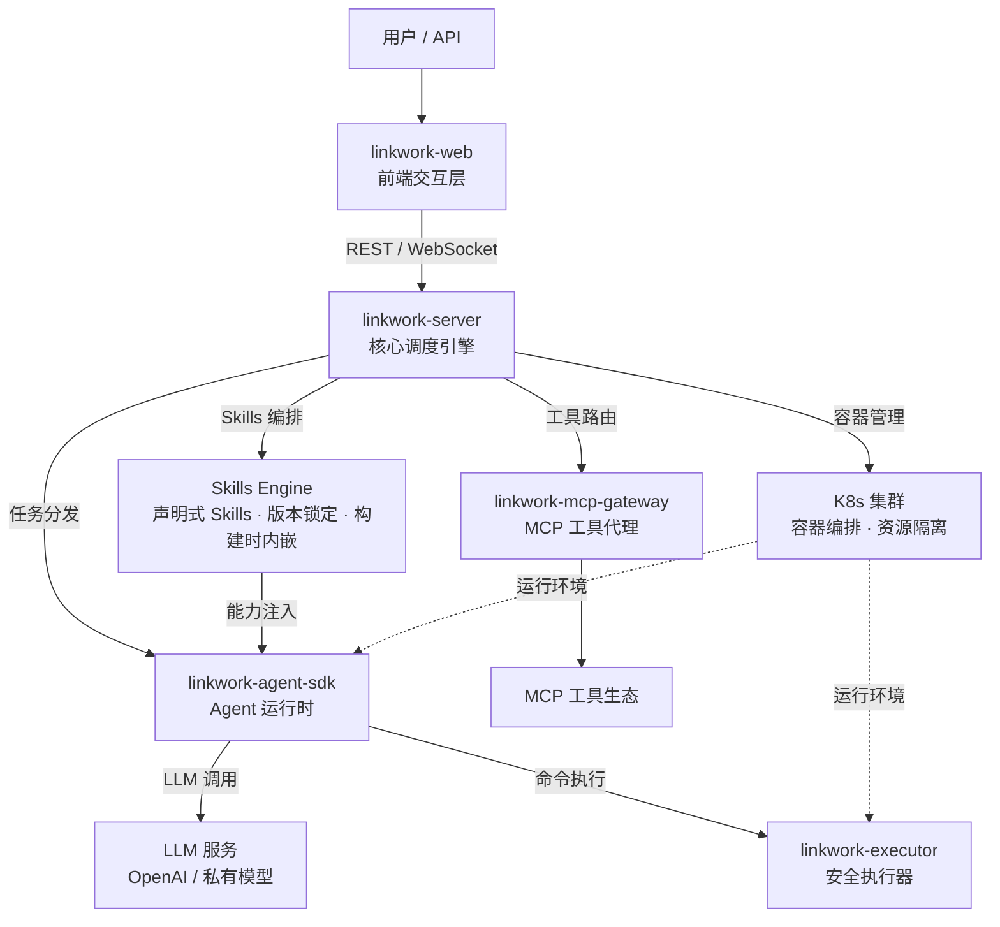

<div align="center">


# 灵工（LinkWork）

### 🤖 让 AI 像员工一样工作

**开源的企业级 AI 员工平台 — 岗位 · 技能 · 工具 · 安全 · 调度，一站式管理你的 AI 团队**

[English](./README.md) | 中文

[](./LICENSE)
[](https://github.com/momotech/LinkWork/stargazers)
[](https://github.com/momotech/LinkWork/issues)
[](./CONTRIBUTING.md)

</div>

---

## 简介

LinkWork 是开源的企业级 **AI Agent 平台**。它不只让 AI “会回答”，更让 AI “能交付”。你可以批量管理容器化 AI 员工，并用声明式配置统一治理岗位、Skills、MCP 工具与安全策略。

从任务编排到结果交付，LinkWork 把 AI 工作流程变成标准化生产线：可编排、可观测、可审计、可复用。

它不是个人助手，而是面向组织协作的 **AI 团队操作系统**。

## 特性

### ⚡ 上线快：从“会用 AI”到“用好 AI”

- **岗位模板化管理** — 统一定义职责、人设、可用 Skills 与工具权限，实例化即可上岗
- **容器级隔离运行** — AI 员工在独立容器中运行，文件系统、网络、进程互相隔离
- **弹性调度与配额治理** — 按岗位设置资源配额，忙时扩展、闲时释放，避免资源争抢

### 🔐 管得住：能力边界清晰可控

- **Skills 版本锁定** — 声明式能力模块，独立版本管理，构建时注入岗位镜像
- **MCP 工具总线** — 兼容 MCP 协议，统一代理、鉴权、健康检查与计量
- **三层能力边界** — 岗位 → Skills → 工具，组合灵活、权限可控、责任可追溯

### ✅ 交付真：结果直接进入生产流程

- **实时任务编排** — 流式追踪任务执行过程，全程可观测
- **定时排班运行** — 基于定时任务的无人值守执行机制
- **双通道工程交付** — 支持 Git / OSS 交付模式，任务结果可直接进入研发流程
- **全链路审计追溯** — LLM 调用、命令执行、工具请求统一留痕，满足审计与合规要求

### 🌱 可演进：平台能力持续扩张

- **AI 供应链治理** — 覆盖镜像构建、安全扫描、版本快照、发现与审计，全链路可管理
- **向量记忆与多模型** — 支持长期知识沉淀、语义检索与多模型切换

## 亮点

### 🧱 一岗位一镜像：把不确定性留在构建阶段

Skills、MCP 配置与安全策略在构建期固化进岗位镜像，运行期保持只读。配置变更必须重构镜像，从机制上杜绝环境漂移，确保线上环境可预测、可复现。

- **构建时固化** — Skills 注入、MCP 描述生成、安全策略打包、版本快照记录一次完成
- **上下文预装** — 任务启动自动完成 Skills 同步、Git 仓库准备与三层 Prompt 组装
- **Fail-fast** — 任一关键步骤失败立即中断构建，拒绝带残缺能力上线

> 一岗位一镜像：环境即代码、版本可锁定、构建可复现、问题早暴露。

### 📦 交付物导向：不是“聊完就算了”

LinkWork 强调“产出即交付物”。任务结果可直接进入代码审查、对象存储与审计系统，形成可交付、可归档、可复盘的工程化闭环。

### 🛡️ 安全默认开启：不靠“人工自觉”

平台采用不可绕过的多层安全机制：深度命令解析、执行与安全进程权限分离、默认网络关闭、高风险操作人工审批。AI 员工对安全代理无感知，从架构层面压缩绕过空间。

> 企业不需要一个"大概能用"的 AI — 需要的是可交付、可审计、可约束的工程化生产力。

## 架构概览



**工作流程**：用户创建任务 → 调度引擎在 K8s 集群中分配容器 → Agent 运行时在隔离环境中启动 → 调用 LLM 推理、通过执行器安全执行命令 → MCP 网关代理外部工具调用 → 全程实时回传执行状态。

## 与个人 AI Agent 的区别

OpenClaw 等项目是优秀的个人 AI 助手 — 跑在你的笔记本上，一个 Agent 帮你处理日常事务。LinkWork 解决的是不同层级的问题：

| | 个人 AI 助手（如 OpenClaw） | LinkWork |
|---|-------------------------|----------|
| **定位** | 个人效率工具 | 企业员工平台 |
| **规模** | 单人单 Agent | 多团队、多 AI 员工并行 |
| **运行环境** | 本地单机 | K8s 集群，容器隔离 |
| **能力管理** | 社区插件，自由安装 | 岗位 → Skills → 工具，三层治理 |
| **安全** | 依赖用户自觉 | 审批流 + 策略引擎 + 审计 |
| **部署** | `npm install -g` | Docker Compose（开发）/ K8s（生产） |
| **Skills 复用** | 个人积累，难以共享 | 个人验证的 Skills 可直接迁入，团队共享、稳定执行 |

> 个人助手解决"我的效率"，LinkWork 解决"组织的效能"。你在个人工具上打磨好的 Skills，可以直接放进 LinkWork，变成整个团队都能用的标准化能力。

## 组件一览

| 组件 | 说明 | 状态 |
|------|------|------|
| **[linkwork-server](https://github.com/momotech/linkwork-server)** | 核心后端 — 任务调度、岗位管理、审批、Skills 与工具注册 | 已开源 |
| **[linkwork-executor](https://github.com/momotech/linkwork-executor)** | 安全执行器 — 容器内命令执行、策略引擎 | 已开源 |
| **[linkwork-agent-sdk](https://github.com/momotech/linkwork-agent-sdk)** | Agent 运行时 — LLM 引擎、Skills 编排、MCP 集成 | 已开源 |
| **[linkwork-mcp-gateway](https://github.com/momotech/linkwork-mcp-gateway)** | MCP 工具网关 — 工具发现、鉴权、用量统计 | 已开源 |
| **[linkwork-backend](https://github.com/momotech/linkwork-backend)** | 后端应用 — 集成 linkwork-server starter 的 Spring Boot 服务，负责镜像构建与任务编排 | 已开源 |
| **[linkwork-web](https://github.com/momotech/linkwork-web)** | 前端参考实现 — 任务面板、岗位配置、Skills 市场 | 已开源 |

## 开源路线图

所有组件已于 2026 年 3 月完成全部开源：

| 阶段 | 组件 | 说明 | 时间 |
|------|------|------|------|
| 第一批 | linkwork-server | 后端核心，含完整调度引擎和 Demo 启动器 | 2026 年 3 月 |
| 第二批 | linkwork-executor + linkwork-agent-sdk | 执行层 — 安全执行器 + Agent 运行时 | 2026 年 3 月 |
| 第三批 | linkwork-mcp-gateway + linkwork-web | 接入层 — MCP 工具网关 + 前端参考实现 | 2026 年 3 月 |

## 部署

### Docker Compose（开发 / 单机）

几分钟内在本地启动完整平台：

```bash
cd deploy/docker
cp .env.example .env          # 编辑 .env 设置数据库密码、JWT 密钥等
docker compose up -d           # 启动 MySQL、Redis、后端、前端等全部服务
```

访问 `http://localhost:3003` 打开 LinkWork 管理界面。详细说明参见 [`deploy/docker/README.md`](./deploy/docker/README.md)。

### Kubernetes（生产）

生产部署使用 `deploy/k8s/` 下的 Kustomize overlay：

```bash
# 开发集群（Kind）
kubectl apply -k deploy/k8s/overlays/dev

# 生产集群
kubectl apply -k deploy/k8s/overlays/prod
```

需要 K8s v1.33+、Volcano、Harbor 和 NFS。详见 [`deploy/k8s/README.md`](./deploy/k8s/README.md) 和完整的 [部署指南](./docs/guides/deployment_zh-CN.md)。

## 文档

| 文档 | 说明 |
|------|------|
| [快速开始](./docs/quick-start_zh-CN.md) | 前提条件、拉取子项目、启动平台服务 |
| [部署指南](./docs/guides/deployment_zh-CN.md) | Docker Compose 开发环境、K8s 生产部署 |
| [扩展开发](./docs/guides/extension_zh-CN.md) | 自定义岗位、Skills、MCP 工具、文件管理、Git 项目 |
| [岗位模型](./docs/concepts/workstation_zh-CN.md) | Workstation → Instance → Task 三层模型 |
| [Skills 系统](./docs/concepts/skills_zh-CN.md) | 声明式技能、版本锁定、构建时注入 |
| [MCP 工具](./docs/concepts/mcp-tools_zh-CN.md) | 标准化外部能力接入 |
| [Harness Engineering](./docs/concepts/harness-engineering_zh-CN.md) | 一岗位一镜像 |
| [系统架构总览](./docs/architecture/overview_zh-CN.md) | 系统上下文、组件关系、技术栈 |
| [示例：文献追踪员](./docs/examples/literature-tracker_zh-CN.md) | 完整岗位配置案例 |

> 完整文档索引：[docs/README_zh-CN.md](./docs/README_zh-CN.md)

## Star History

<div align="center">
<a href="https://star-history.com/#momotech/LinkWork&Date">
  <picture>
    <source media="(prefers-color-scheme: dark)" srcset="https://api.star-history.com/svg?repos=momotech/LinkWork&type=Date&theme=dark" />
    <source media="(prefers-color-scheme: light)" srcset="https://api.star-history.com/svg?repos=momotech/LinkWork&type=Date" />
    
  </picture>
</a>
</div>

## 许可证

[Apache License 2.0](./LICENSE)

## 关注我们

所有组件已完成开源。如果你对企业级 AI 员工管理感兴趣：

- 点个 **Star** 追踪最新进展
- **Watch** 本仓库获取发布通知
- 欢迎在 Issues 中提出想法和建议

---

<div align="center">

**LinkWork** — 不是给你一个 AI 助手，而是给你一支 AI 团队

</div>
